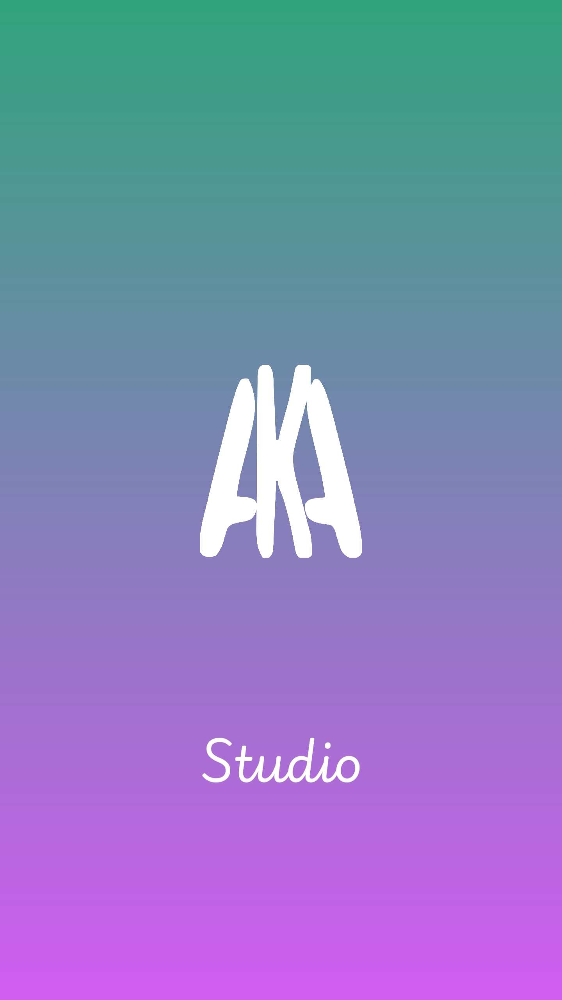
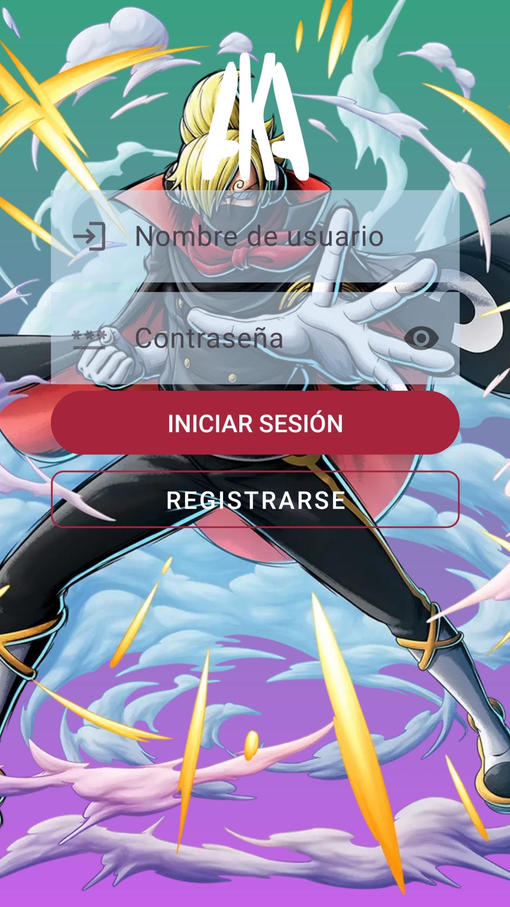
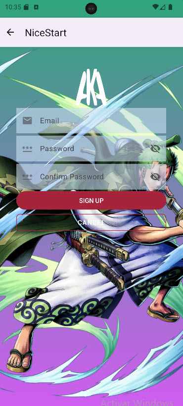
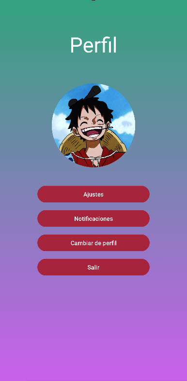
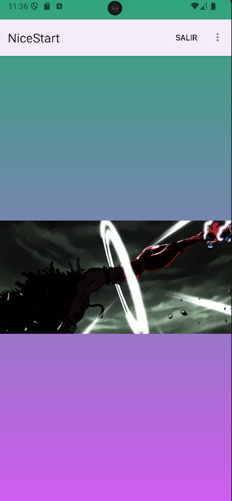

# Aplicación de Desarrollo de Interfaces

Esta aplicación ha sido desarrollada como parte de un proyecto de creación de interfaces. A continuación, se presentan las características y los cambios implementados.

## Cambios Realizados

- **Desarrollo del main**: Se ha añadido algunos cambios en el main:

- Se ha agregado un menu que lleva a perfil y con demás opciones.
- Un webview que ejecuta un gif.

## Características de la Aplicación

La aplicación cuenta con las siguientes pantallas:

### Pantalla de Splash

- Introducción visual mientras se cargan los recursos.

  

### Pantalla de Login

- Interfaz amigable que permite a los usuarios iniciar sesión.
- **Glide** integrado para gestión y carga de imágenes.

  

### Pantalla de Registro

- Interfaz sencilla para el registro de nuevos usuarios.
- También incluye **Glide** para la carga de imágenes.

  

### Pantalla de Perfil

- Pantalla donde el usuario podrá acceder a su cuenta y salir al menu de login.

  

### Pantalla Principal

- Se muestra una pantalla, donde el usuario ve una imagen de webview, además de poder acceder a un
menu con distintas opciones, como ir al perfil y salir de la aplicación.

  
